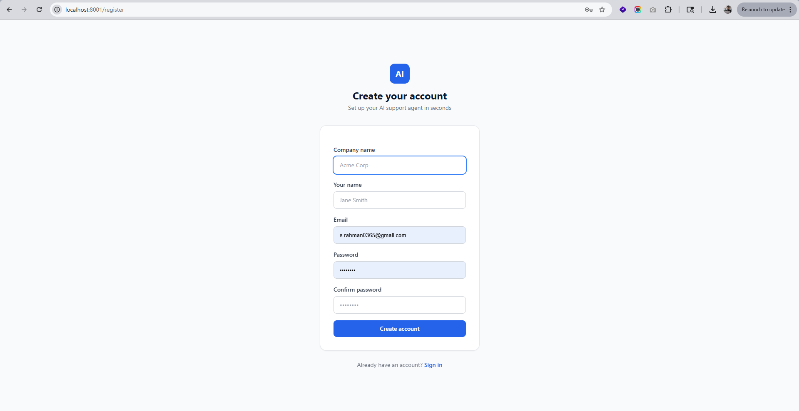
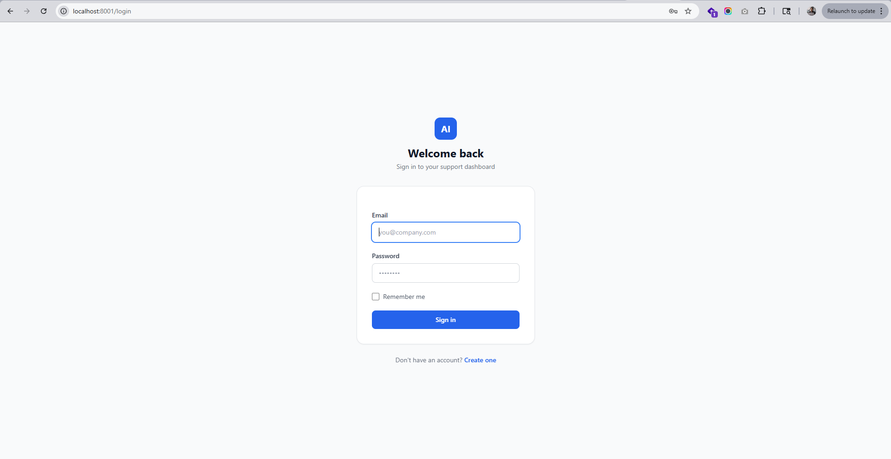
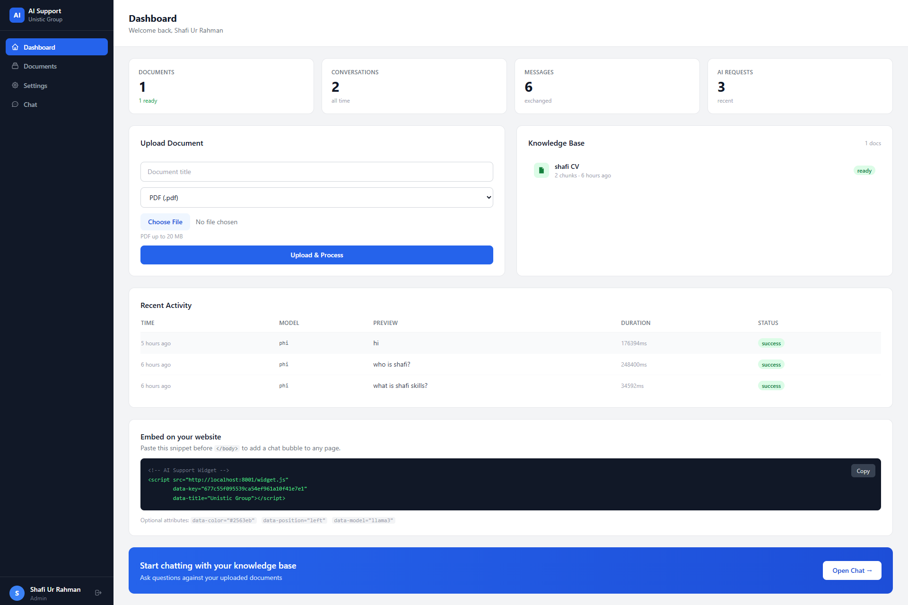
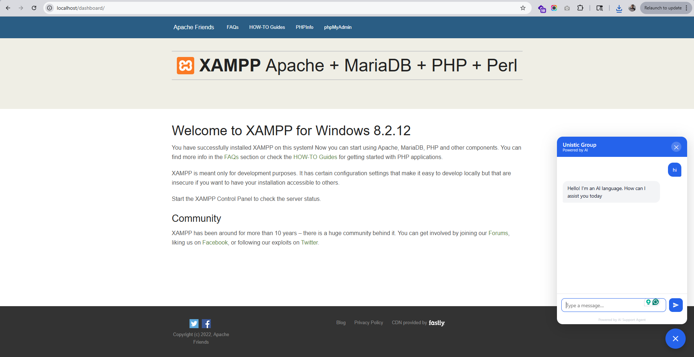
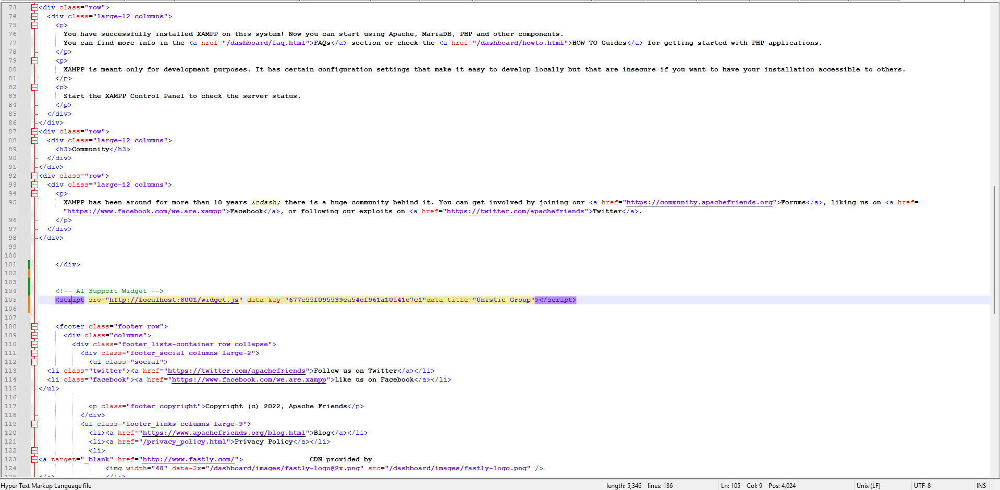

# 🤖 AI SaaS Support Agent  
### 🏢 Multi-Tenant | 🧠 RAG | 💻 Self-Hosted LLM (Ollama) | ⚡ Laravel 12

  
  
  
  
  
  

---

## 🚀 Overview

A production-ready AI support platform that allows companies to:

- Upload documents 📄  
- Train their own AI assistant 🤖  
- Embed it into any website 🌐  

👉 Powered by local LLMs (Ollama) — zero API cost

---

## 🎬 Demo Flow

1. Register a company (tenant)  
2. Upload documents  
3. Convert → embeddings (Qdrant)  
4. Ask questions  
5. AI retrieves context (RAG)  
6. Ollama generates response  
7. Streaming answer to user  

---

## 🖥️ Screenshots

### Authentication

### Dashboard

### AI Assistant

### Widget

---

## 🧠 Features

- Multi-tenant architecture  
- Document ingestion (PDF, DOCX, CSV, TXT, URL)  
- RAG-based AI  
- Local LLM (Ollama)  
- Streaming responses  
- REST API  
- Embeddable widget  
- Queue processing  

---

## 🏗️ Architecture

User → Laravel → RAG → Qdrant → Ollama → Response

---

## ⚙️ Tech Stack

- Laravel 12  
- PHP 8.2+  
- MySQL  
- Qdrant  
- Ollama  
- Tailwind CSS  

---

## 🚀 Quick Start

git clone https://github.com/shafi-rahman/ai-saas-support-agent.git
cd ai-saas-support-agent/laravel-app

composer install
cp .env.example .env
php artisan key:generate
php artisan migrate

php artisan serve
php artisan queue:work

---

## 👨‍💻 Author

Shafi Rahman  
Senior PHP / Laravel Developer  

---

## 📄 License

MIT
